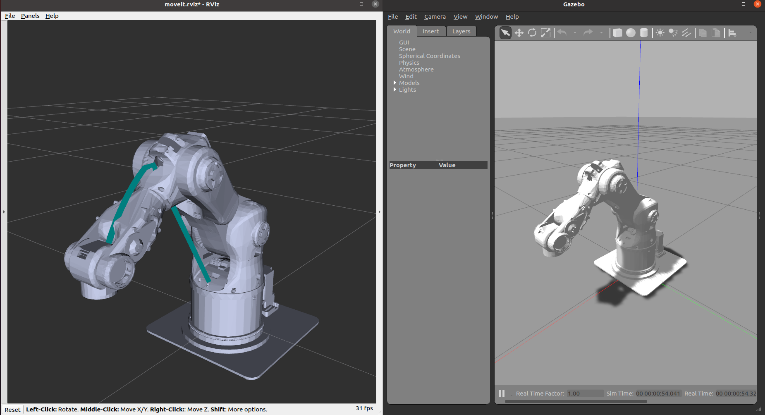
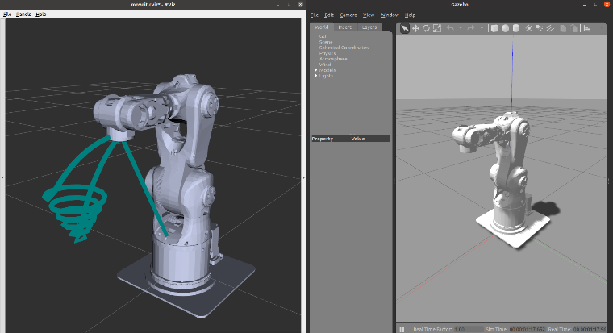
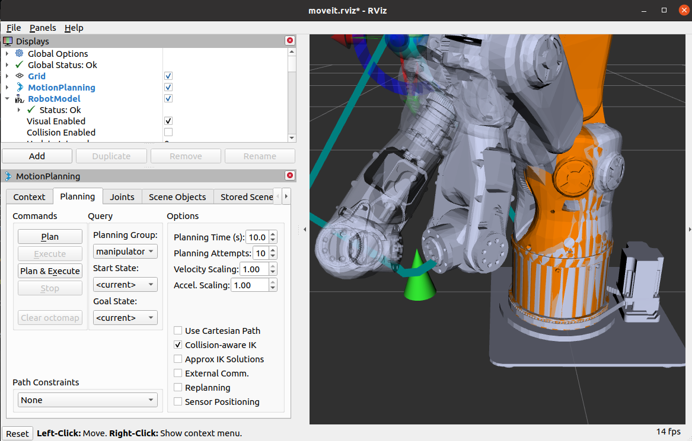

# 🤖 Robotic-arm

轻量级 ROS Noetic + MoveIt 工程，用于 Probot 机械臂的仿真、控制与示例。

## 📋 项目概览
本仓库包含 Probot 机械臂的描述、Gazebo 仿真场景、MoveIt 规划配置与 demo 节点，支持正逆运动学、轨迹生成与位姿发布。

## 🎯 效果展示



<table><tr>
<td></td>
<td></td>
</tr></table>

## 📁 主要目录
- `src/` — ROS 包源代码（probot_description、probot_gazebo、probot_demo、probot_anno_moveit_config 等）
- `build/`、`build_isolated/` — 构建产物
- `devel/`、`devel_isolated/` — catkin 开发空间
- `images/` — 项目图片资源
- `frames.gv` — 帧关系的 Graphviz 描述
- `README.md` — 本文件

## ✨ 主要特性
- Probot 机械臂 URDF 与模型描述
- Gazebo 仿真场景与物理插件
- MoveIt 运动规划配置与交互演示
- 示例节点与 launch 文件，便于快速验证与测试

## ⚙️ 环境要求
- **操作系统**：Ubuntu 20.04
- **ROS 版本**：Noetic
- **仿真工具**：Gazebo（可选，用于仿真演示）
- **规划库**：MoveIt for Noetic（可选，用于路径规划与交互）

## 🚀 快速开始

### 1. 初始化 ROS 环境
```bash
source /opt/ros/noetic/setup.bash
```

### 2. 进入工作区并构建
```bash
cd workspace
catkin_make
```
> **注**：Windows 用户请在 WSL/WSL2 或 Ubuntu 虚拟机中执行上述命令

### 3. 加载开发环境
```bash
source devel/setup.bash
```

### 4. 运行示例

**启动 Gazebo 仿真**（带物理引擎）：
```bash
roslaunch probot_gazebo probot_world.launch
```

**启动 MoveIt 演示**（交互式规划）：
```bash
roslaunch probot_anno_moveit_config demo.launch
```

**运行 demo 节点**（正逆运动学示例）：
```bash
rosrun probot_demo <node_name>
```

## 🛠️ 开发与调试

- **推荐编辑器**：VS Code（仓库内含 `.vscode` 配置）
- **重新编译**：修改源代码后运行
  ```bash
  catkin_make
  # 或仅编译特定包
  catkin_make --pkg <package_name>
  ```
- **可视化工具**：使用 `rviz`、`rostopic`、`rqt_graph` 等进行调试与数据监控

## ❓ 常见问题

**问题 1：找不到包或缺少依赖**  
解决方案：
```bash
rosdep update
rosdep install --from-paths src --ignore-src -r -y
```

**问题 2：Launch 文件或节点不确定位置**  
解决方案：使用以下命令快速定位：
```bash
roscd <package_name>
rosls <package_name>
# 或手动查看包目录结构
```

## 📚 参考资源
- **核心包**：probot_description, probot_gazebo, probot_demo, probot_anno_moveit_config
- **坐标帧可视化**：`frames.gv`（可用 Graphviz 工具打开）
- **ROS 文档**：https://wiki.ros.org/noetic
- **MoveIt 文档**：https://moveit.ros.org/
